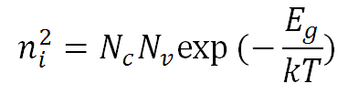

#  Semiconductor Property Calculator

This is a simple Python tool that calculates key material properties used in semiconductor physics. The current version focuses on **intrinsic carrier concentration (nᵢ)** using standard physical equations.


It is ideal for physics students and anyone learning about semiconductors who wants to combine coding and science.

---

##  Features

- Calculates **intrinsic carrier concentration (nᵢ)** based on:
  - Temperature (T) in Kelvin
  - Bandgap energy (E₉) in electronvolts
  - Effective density of states for conduction (N_c) and valence bands (N_v)
- Clean and interactive command-line interface
- Can be extended later with more calculations like Fermi level, conductivity, or doping effects

---

##  Background

The intrinsic carrier concentration nᵢ is an important value in semiconductor physics. It tells us how many charge carriers (electrons and holes) are present in a pure semiconductor at a given temperature.

###  Formula Used:


Where:

- **N_c**: Effective density of states in conduction band (in cm⁻³)  
- **N_v**: Effective density of states in valence band (in cm⁻³)  
- **E₉**: Bandgap energy (in eV)  
- **T**: Temperature (in Kelvin)  
- **k**: Boltzmann constant = 8.617×10⁻⁵ eV/K  

Table of values for Nc, Nv and Band-gap energy (Eg) which is nearly constant with temperature.at T=300K


* The values are given for T=300K and will be scaled up/down during the calculations according to the input temperature.

source : https://www.calctown.com/calculators/intrinsic-carrier-concentration

---

##  Example

Enter temperature (K): 300
Enter bandgap energy (eV): 1.12
Enter effective density of states in conduction band (per cm³): 2.8e19
Enter effective density of states in valence band (per cm³): 1.04e19

Intrinsic Carrier Concentration (ni) = 1.45e10 cm⁻³

##  How to Use

### 1. Clone the repository:
```bash
git clone https://github.com/Zeyad-Mustafa/semiconductor-property-calculator.git
cd semiconductor-property-calculator


### Run the script:

python main.py
### Enter values when prompted:
Temperature (in K)

Bandgap energy (in eV)

N_c and N_v (in cm⁻³)

You’ll get the intrinsic carrier concentration printed on the screen.
